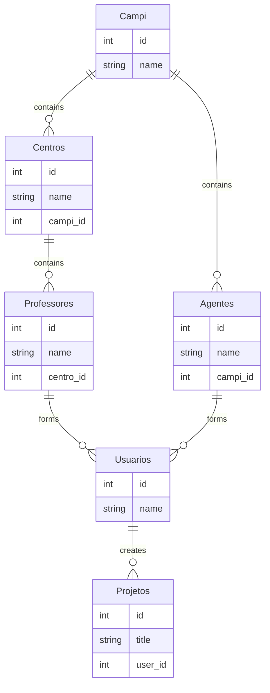

```

## Configuração
As credenciais do banco de dados estão no arquivo `./app/Db/Database.php` e você deve alterar para as configurações do seu ambiente (HOST, NAME, USER e PASS).

## Composer
Para a aplicação funcionar, é necessário rodar o Composer para que sejam criados os arquivos responsáveis pelo autoload das classes.

Caso não tenha o Composer instalado, baixe pelo site oficial: [https://getcomposer.org/download](https://getcomposer.org/download/)

Para rodar o composer, basta acessar a pasta do projeto e executar o comando abaixo em seu terminal:
```shell
 composer install
```

Após essa execução uma pasta com o nome `vendor` será criada na raiz do projeto e você já poderá acessar pelo seu navegador.
