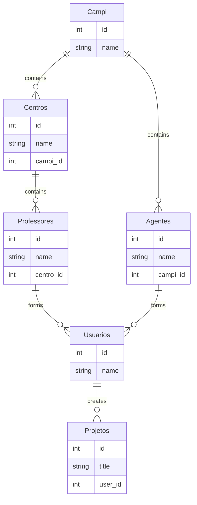

```

# CRUD com PHP orientado a objetos, PDO e MySQL - WDEV
Código da implementação de um CRUD com PHP orientado a objetos e MySQL apresentado no canal [WDEV](http://wstore.io/wdev).

## Vídeo WDEV
Para assistir o vídeo dessa implementação, acesse: [CRUD com PHP orientado a objetos, PDO e MySQL (YouTube)](https://www.youtube.com/watch?v=uG64BgrlX7o)

## Banco de dados
Crie um banco de dados e execute as instruções SQLs abaixo para criar a tabela `vagas`:
```sql
  CREATE TABLE `vagas` (
  	`id` INT(11) NOT NULL AUTO_INCREMENT,
  	`titulo` VARCHAR(255) NOT NULL COLLATE 'utf8_general_ci',
  	`descricao` TEXT(65535) NOT NULL COLLATE 'utf8_general_ci',
  	`ativo` ENUM('s','n') NOT NULL COLLATE 'utf8_general_ci',
  	`data` TIMESTAMP NOT NULL DEFAULT current_timestamp() ON UPDATE current_timestamp(),
  	PRIMARY KEY (`id`) USING BTREE
  )
  COLLATE='utf8_general_ci'
  ENGINE=InnoDB
  AUTO_INCREMENT=1;
```

## Configuração
As credenciais do banco de dados estão no arquivo `./app/Db/Database.php` e você deve alterar para as configurações do seu ambiente (HOST, NAME, USER e PASS).

## Composer
Para a aplicação funcionar, é necessário rodar o Composer para que sejam criados os arquivos responsáveis pelo autoload das classes.

Caso não tenha o Composer instalado, baixe pelo site oficial: [https://getcomposer.org/download](https://getcomposer.org/download/)

Para rodar o composer, basta acessar a pasta do projeto e executar o comando abaixo em seu terminal:
```shell
 composer install
```

Após essa execução uma pasta com o nome `vendor` será criada na raiz do projeto e você já poderá acessar pelo seu navegador.
